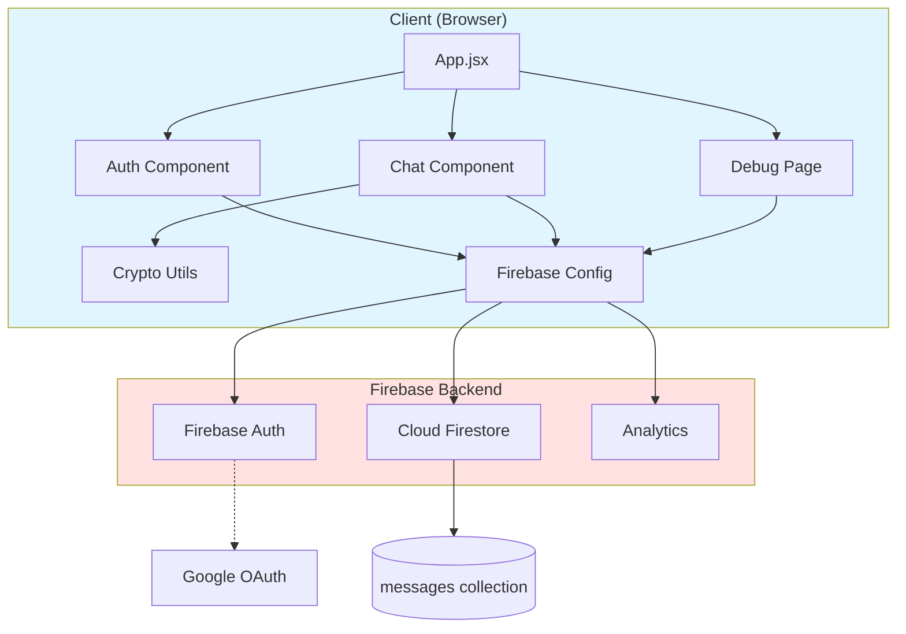
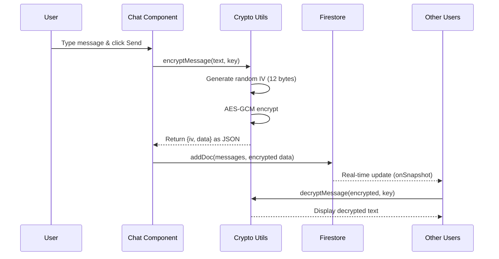
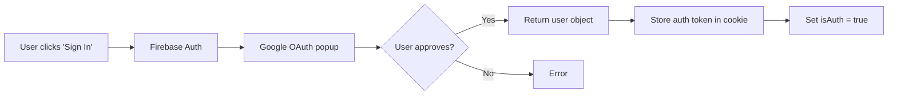

# ShieldChat

A secure, real-time chat application with **End-to-End Encryption (E2EE)** using **AES-GCM**, built with **React**, **Firebase**, and **Vite**.

---

## 📋 Table of Contents

- [About The Project](#about-the-project)
- [Key Features](#key-features)
- [Technology Stack](#technology-stack)
- [Project Architecture](#project-architecture)
- [Data Flow](#data-flow)
- [Security & Encryption](#security--encryption)
- [Firebase Integration](#firebase-integration)
- [Project Structure](#project-structure)
- [Getting Started](#getting-started)
- [Usage Guide](#usage-guide)
- [Component Breakdown](#component-breakdown)
- [Debug Panel](#debug-panel)
- [License](#license)

---

## 🎯 About The Project

**ShieldChat** is a privacy-focused, real-time chat application that implements **client-side end-to-end encryption** using the **AES-GCM algorithm**. Messages are encrypted on the sender's device before being sent to Firebase Firestore, ensuring that even the server cannot read the message content.

The application provides a simple yet powerful interface for users to:
- Authenticate securely with Google
- Join chat rooms
- Send encrypted messages in real-time
- Debug and inspect raw encrypted payloads

---

## 🚀 Key Features

### 🔐 **Client-Side End-to-End Encryption (E2EE)**
Messages are encrypted using **AES-GCM** (256-bit) before being stored in Firebase. Only users with the correct room password can decrypt and read messages.

### 🔥 **Firebase Integration**
- **Firebase Authentication:** Secure Google OAuth sign-in
- **Cloud Firestore:** Real-time database for message storage
- **Firebase Analytics:** Track app usage (optional)

### 💬 **Real-Time Messaging**
Messages are delivered instantly using Firestore's real-time listeners (`onSnapshot`). No polling or refresh required.

### 🛡️ **Persistent Sessions**
Cookie-based session management keeps users logged in across page refreshes.

### 🔍 **Debug Panel**
A developer-focused page (`/debug/encrypted`) displays raw encrypted messages stored in Firestore, complete with IV, ciphertext, and metadata.

### 🎨 **Modern UI**
Built with **React** and **Tailwind CSS** for a clean, responsive interface.

---

## 🛠️ Technology Stack

| Technology | Purpose |
|------------|---------|
| **React 19** | UI library for building interactive components |
| **Vite 7** | Fast development server and build tool |
| **Firebase 12** | Backend services (Auth, Firestore, Analytics) |
| **Tailwind CSS 4** | Utility-first CSS framework |
| **React Router DOM 7** | Client-side routing |
| **Universal Cookie 8** | Cookie management for session persistence |
| **Web Crypto API** | Browser-native cryptography for AES-GCM |

---

## 🏗️ Project Architecture

ShieldChat follows a **component-based architecture** with clear separation of concerns:



### Architecture Layers

1. **Presentation Layer** (`components/`, `pages/`)
   - React components that render the UI
   - Handle user interactions

2. **Business Logic Layer** (`utils/`)
   - Encryption/decryption logic
   - Key derivation from passwords

3. **Data Layer** (`firebase-config.js`)
   - Firebase initialization
   - Firestore database connection
   - Authentication provider setup

---

## 🔄 Data Flow

### Message Sending Flow



### Detailed Step-by-Step Flow

#### **1. User Authentication**


#### **2. Encryption & Message Sending**
1. User enters **room password** (optional)
2. Password is used with **PBKDF2** to derive a 256-bit AES key
   - Salt: Room name (ensures different keys per room)
   - Iterations: 100,000
   - Hash: SHA-256
3. User types a message and clicks "Send"
4. Message is encrypted:
   - Generate random 12-byte **IV** (Initialization Vector)
   - Use **AES-GCM** to encrypt message with derived key
   - Output: `{iv: [bytes], data: [encrypted bytes]}`
5. Encrypted payload (as JSON string) is sent to Firestore
6. Firestore stores the message with metadata:
   ```javascript
   {
     text: "{\"iv\":[...],\"data\":[...]}",
     createdAt: serverTimestamp(),
     user: "John Doe",
     userId: "uid123",
     room: "general"
   }
   ```

#### **3. Real-Time Message Receiving**
1. Chat component subscribes to Firestore with `onSnapshot`
2. Query filters messages by `room` and sorts by `createdAt`
3. When a new message arrives:
   - Check if message is encrypted (JSON with `iv` field)
   - If user has the correct password:
     - Decrypt using `decryptMessage()`
     - Display plaintext
   - If no password or wrong password:
     - Display "🔒 Encrypted Message"

---

## 🔐 Security & Encryption

### AES-GCM Algorithm Explained

**AES-GCM** (Advanced Encryption Standard - Galois/Counter Mode) is a symmetric encryption algorithm that provides:
- **Confidentiality:** Data is encrypted and unreadable without the key
- **Authenticity:** Built-in authentication tag prevents tampering
- **Performance:** Fast encryption/decryption in modern browsers

#### Why AES-GCM?
- **256-bit key length:** Military-grade security
- **Authenticated encryption:** Prevents message tampering
- **Native browser support:** Uses Web Crypto API (no external libraries)
- **Randomized IV:** Each message uses a unique initialization vector

### Encryption Implementation

#### **Key Derivation (PBKDF2)**
Located in [`src/utils/crypto.js`](file:///Users/ishansaraswat/Desktop/farmchat-clean/src/utils/crypto.js#L2-L24)

```javascript
export const generateKeyFromPassword = async (password, salt) => {
  const enc = new TextEncoder();
  // Import password as key material
  const keyMaterial = await window.crypto.subtle.importKey(
    "raw",
    enc.encode(password),
    { name: "PBKDF2" },
    false,
    ["deriveKey"]
  );

  // Derive AES-GCM key using PBKDF2
  return window.crypto.subtle.deriveKey(
    {
      name: "PBKDF2",
      salt: enc.encode(salt),        // Room name as salt
      iterations: 100000,             // 100k iterations (slow brute-force)
      hash: "SHA-256",
    },
    keyMaterial,
    { name: "AES-GCM", length: 256 }, // 256-bit AES key
    true,
    ["encrypt", "decrypt"]
  );
};
```

**Parameters:**
- **Password:** User-provided room password
- **Salt:** Room name (ensures different keys for different rooms)
- **Iterations:** 100,000 (slows down brute-force attacks)
- **Output:** 256-bit AES-GCM encryption key

#### **Message Encryption**
Located in [`src/utils/crypto.js`](file:///Users/ishansaraswat/Desktop/farmchat-clean/src/utils/crypto.js#L26-L46)

```javascript
export const encryptMessage = async (text, key) => {
  const enc = new TextEncoder();
  const iv = window.crypto.getRandomValues(new Uint8Array(12)); // Random IV
  const encodedText = enc.encode(text);

  const ciphertext = await window.crypto.subtle.encrypt(
    {
      name: "AES-GCM",
      iv: iv,
    },
    key,
    encodedText
  );

  // Return as JSON string for storage
  return JSON.stringify({
    iv: Array.from(iv),                        // Convert to array
    data: Array.from(new Uint8Array(ciphertext)), // Encrypted bytes
  });
};
```

**Process:**
1. Generate random 12-byte IV (unique per message)
2. Encode message text as UTF-8 bytes
3. Encrypt using AES-GCM with key and IV
4. Return `{iv, data}` as JSON string

#### **Message Decryption**
Located in [`src/utils/crypto.js`](file:///Users/ishansaraswat/Desktop/farmchat-clean/src/utils/crypto.js#L48-L70)

```javascript
export const decryptMessage = async (encryptedDataString, key) => {
  try {
    const { iv, data } = JSON.parse(encryptedDataString);
    const ivArray = new Uint8Array(iv);
    const dataArray = new Uint8Array(data);

    const decryptedBuffer = await window.crypto.subtle.decrypt(
      {
        name: "AES-GCM",
        iv: ivArray,
      },
      key,
      dataArray
    );

    const dec = new TextDecoder();
    return dec.decode(decryptedBuffer);
  } catch (error) {
    console.error("Decryption failed:", error);
    return null; // Wrong password or corrupted data
  }
};
```

**Process:**
1. Parse JSON to extract `iv` and `data`
2. Convert arrays back to Uint8Array
3. Decrypt using AES-GCM with key and IV
4. Decode bytes back to UTF-8 text
5. Return plaintext or `null` if decryption fails

### Security Properties

✅ **End-to-End Encryption:** Messages are encrypted on client, decrypted on client  
✅ **Zero-Knowledge Server:** Firebase cannot read message content  
✅ **Unique IVs:** Every message has a unique initialization vector  
✅ **Authentication Tag:** AES-GCM prevents message tampering  
✅ **Strong Key Derivation:** PBKDF2 with 100k iterations  
❌ **No Forward Secrecy:** Room password is reused (not a perfect forward secrecy protocol)  
❌ **No Key Exchange:** Users must share password out-of-band  

---

## 🔥 Firebase Integration

### Firebase Services Used

#### **1. Firebase Authentication**
Located in [`src/firebase-config.js`](file:///Users/ishansaraswat/Desktop/farmchat-clean/src/firebase-config.js#L23-L24)

```javascript
export const auth = getAuth(app);
export const provider = new GoogleAuthProvider();
```

**Features:**
- Google OAuth 2.0 sign-in
- Session management with access tokens
- User profile (name, email, photo)

**Usage in** [`src/components/Auth.jsx`](file:///Users/ishansaraswat/Desktop/farmchat-clean/src/components/Auth.jsx#L9-L18):
```javascript
const signInWithGoogle = async () => {
  const result = await signInWithPopup(auth, provider);
  cookies.set("auth-token", result.user.accessToken);
  setIsAuth(true);
};
```

#### **2. Cloud Firestore**
Located in [`src/firebase-config.js`](file:///Users/ishansaraswat/Desktop/farmchat-clean/src/firebase-config.js#L25)

```javascript
export const db = getFirestore(app);
```

**Collection:** `messages`

**Document Schema:**
```javascript
{
  text: String,         // Encrypted payload (JSON) or plaintext
  createdAt: Timestamp, // Server timestamp
  user: String,         // Display name
  userId: String,       // Firebase UID
  room: String          // Room name
}
```

**Firestore Index Required:**
To query messages by room and sort by creation time, create a composite index:
- Collection: `messages`
- Fields: `room` (Ascending), `createdAt` (Ascending)

#### **3. Real-Time Listeners**
Located in [`src/components/Chat.jsx`](file:///Users/ishansaraswat/Desktop/farmchat-clean/src/components/Chat.jsx#L39-L96)

```javascript
const queryMessages = query(
  messagesRef,
  where("room", "==", room),
  orderBy("createdAt")
);

const unsuscribe = onSnapshot(
  queryMessages,
  (snapshot) => {
    // Process and decrypt messages
    processMessages(snapshot.docs);
  }
);
```

**How it works:**
1. Create a query filtered by room name
2. Subscribe to real-time updates with `onSnapshot`
3. Firestore pushes new messages instantly
4. Component decrypts and displays messages

---

## 📁 Project Structure

```
farmchat-clean/
├── public/             # Static assets
├── src/
│   ├── assets/         # Images, icons
│   ├── components/
│   │   ├── Auth.jsx    # Google sign-in component
│   │   └── Chat.jsx    # Main chat interface
│   ├── pages/
│   │   └── DebugEncrypted.jsx  # Debug panel for encrypted messages
│   ├── styles/
│   │   └── chat.css    # Chat component styles
│   ├── utils/
│   │   └── crypto.js   # AES-GCM encryption utilities
│   ├── App.css         # App-level styles
│   ├── App.jsx         # Main app component with routing
│   ├── firebase-config.js  # Firebase initialization
│   ├── index.css       # Global styles
│   └── main.jsx        # React entry point
├── .gitignore
├── eslint.config.js
├── index.html
├── package.json
├── postcss.config.js
├── tailwind.config.js
├── vite.config.js
└── README.md
```

---

## 🚀 Getting Started

### Prerequisites

- **Node.js** (v18 or higher)
- **npm** or **yarn**
- **Firebase project** with Firestore and Authentication enabled

### Installation

1. **Clone the repository:**
   ```bash
   git clone https://github.com/yourusername/shieldchat.git
   cd shieldchat
   ```

2. **Install dependencies:**
   ```bash
   npm install
   ```

3. **Configure Firebase:**
   
   Update [`src/firebase-config.js`](file:///Users/ishansaraswat/Desktop/farmchat-clean/src/firebase-config.js) with your Firebase project credentials:
   
   ```javascript
   const firebaseConfig = {
     apiKey: "YOUR_API_KEY",
     authDomain: "YOUR_AUTH_DOMAIN",
     projectId: "YOUR_PROJECT_ID",
     storageBucket: "YOUR_STORAGE_BUCKET",
     messagingSenderId: "YOUR_MESSAGING_SENDER_ID",
     appId: "YOUR_APP_ID"
   };
   ```

4. **Enable Firebase services:**
   - Go to [Firebase Console](https://console.firebase.google.com/)
   - Enable **Google Authentication**
   - Create a **Firestore database** (start in test mode)
   - Create a composite index for `messages` collection:
     - Fields: `room` (Ascending), `createdAt` (Ascending)

5. **Start the development server:**
   ```bash
   npm run dev
   ```

6. **Open the app:**
   Navigate to `http://localhost:5173` (or the port shown in terminal)

---

## 📖 Usage Guide

### 1️⃣ Sign In
Click **"Sign In With Google"** to authenticate with your Google account.

### 2️⃣ Enter Room Name
Type the name of the chat room you want to join (e.g., "General", "Work", "Friends").

### 3️⃣ Set Room Password (Optional)
- **With Password:** Messages will be encrypted using AES-GCM
- **Without Password:** Messages are stored as plaintext in Firestore

> ⚠️ **Important:** All users in the same room must use the **same password** to read encrypted messages.

### 4️⃣ Start Chatting
Type your message and click **Send**. Messages appear instantly for all users in the room.

### 5️⃣ Leave Room or Sign Out
- Click **"Leave Room"** to join a different room
- Click **"Sign Out"** to log out completely

### 6️⃣ Debug Encrypted Messages
Navigate to `/debug/encrypted` to view raw encrypted payloads stored in Firestore.

---

## 🧩 Component Breakdown

### [`App.jsx`](file:///Users/ishansaraswat/Desktop/farmchat-clean/src/App.jsx)
**Main application component** with React Router.

**Routes:**
- `/` - Home page (Auth or Chat)
- `/debug/encrypted` - Debug panel

**State Management:**
- `isAuth` - Tracks authentication status
- `room` - Current room name
- `roomPassword` - Room password for encryption

### [`components/Auth.jsx`](file:///Users/ishansaraswat/Desktop/farmchat-clean/src/components/Auth.jsx)
**Authentication component** for Google sign-in.

**Features:**
- Google OAuth popup (`signInWithPopup`)
- Stores auth token in cookie
- Updates app authentication state

### [`components/Chat.jsx`](file:///Users/ishansaraswat/Desktop/farmchat-clean/src/components/Chat.jsx)
**Main chat interface** with encryption.

**Key Responsibilities:**
1. Derive encryption key from password + room name
2. Subscribe to Firestore messages in real-time
3. Decrypt incoming messages
4. Encrypt outgoing messages
5. Display messages with sender/receiver styling

**Hooks Used:**
- `useEffect` - Initialize encryption key and subscribe to messages
- `useState` - Manage messages, loading, errors, crypto key

### [`pages/DebugEncrypted.jsx`](file:///Users/ishansaraswat/Desktop/farmchat-clean/src/pages/DebugEncrypted.jsx)
**Debug panel** for viewing raw encrypted data.

**Features:**
- Real-time view of all messages in Firestore
- Filter by room name
- Display IV, ciphertext, metadata
- Useful for debugging encryption issues

### [`utils/crypto.js`](file:///Users/ishansaraswat/Desktop/farmchat-clean/src/utils/crypto.js)
**Encryption utility functions** using Web Crypto API.

**Exports:**
- `generateKeyFromPassword(password, salt)` - Derives AES key using PBKDF2
- `encryptMessage(text, key)` - Encrypts message with AES-GCM
- `decryptMessage(encryptedData, key)` - Decrypts message with AES-GCM

---

## 🔍 Debug Panel

Access the debug panel at `/debug/encrypted` to inspect raw encrypted messages.

**What you'll see:**
- **Room:** Room name
- **UID:** User Firebase ID
- **Name:** User display name
- **Created At:** Timestamp
- **cipherText (Raw):** Encrypted JSON payload

**Example encrypted payload:**
```json
{
  "iv": [123, 45, 67, 89, ...],
  "data": [234, 56, 78, 90, ...]
}
```

**Use cases:**
- Verify messages are encrypted before storage
- Debug decryption failures
- Inspect message metadata
- Test different room passwords

---

## 📝 License

Distributed under the **MIT License**. See `LICENSE.txt` for more information.

---

## 🤝 Contributing

Contributions are welcome! Please feel free to submit a Pull Request.

---

## 📧 Contact

For questions or feedback, please open an issue on GitHub.

---

**Built with ❤️ using React, Firebase, and Web Crypto API**
